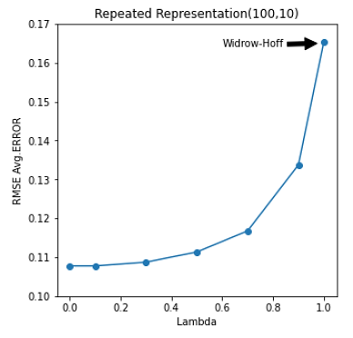

# Project 1 - Incrementally Understanding Sutton

This report replicates the experiments described in the renowned paper ``Learning to Predict by the Methods of Temporal Differences'' by Richard Sutton (1988). Specifically, the report describes the random walk problem, discusses the theory behind solving the problem, provides pseudo-codes where required and contextualizes the similarities and differences in the results while mentioning the pitfalls and challenges faced in replicating the results.

#### Jupyter Notebook file contains all the codes and plots that were used in the report.

## Bounded Random-walk Setup

## Sutton Figure 3: Training Set (100,10)

## Repeated Representation Combined Plot of different Training Sets

## Sutton Figure 4: Training Set (100,10)

## Simgle Representation Training Set (1000,5) - Exploratory Experiment

## Sutton Figure 4: Best Alpha Training Set (100,10)

## Best Alpha Combined Plot

